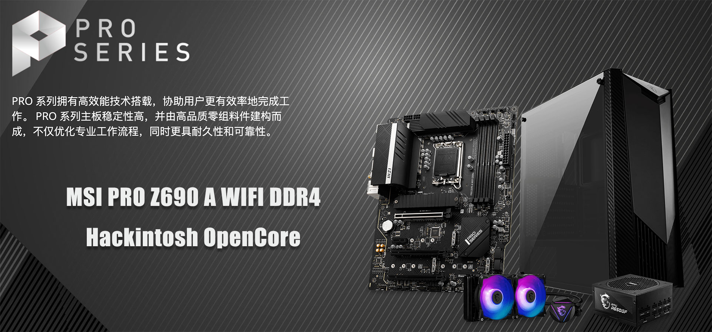
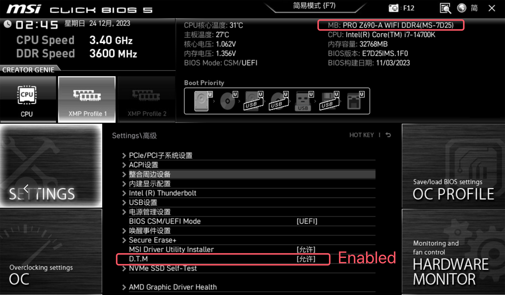

## MSI PRO Z690 A WIFI DDR4 黑苹果 OpenCore EFI



[OpenCore 0.9.9](https://github.com/acidanthera/OpenCorePkg)


### macOS

- Monterey
- Ventura
- Sonoma


### 硬件

- 芯片组: Z690
- BIOS版本：E7D251MS.1F0 2023-11-03
- 处理器: 英特尔14代 i7-14700K
- 内   存:  金百达 32GB（16GB*2） DDR4 3200Mhz
- 硬   盘:  致钛TiPlus 1TB MacOS
- 核   显:  英特尔超核心显卡730 (仅能在 Windows中使用)
- 显   卡:  华擎 Radeon RX6650XT
- 声   卡:  瑞昱 ALC897
- 有线网卡: 英特尔 L225-V
- 无线网卡：T919


### BIOS设置

```
1.关闭安全启动
Settings
  |-- Security
     |-- Secure Boot
       |-- Secure Boot: Disabled

2.使用搜索功能查找并启用 D.T.M 
Search
  |-- D.T.M
    |-- D.T.M: Enabled

```





### 注意事项

 - 安装成功后必须使用 [OpenCore Configurator](https://mackie100projects.altervista.org/opencore-configurator/) 或者 [OCAuxiliaryTools](https://github.com/ic005k/OCAuxiliaryTools) 生成你自己的 SMBIOS
 - 如需使用没有小核心的CPU，必须取消勾选配置文件中Kernel--ProvideCurrentCpuinfo选项


### 联系我们

QQ Group: 23304408


### 参考内容

[1.黑苹果安装过程演示](https://hackintosh.club/d/10000060)

[2.英特尔无线网卡WiFi驱动](https://hackintosh.club/d/10000015)

[3.英特尔无线网卡蓝牙驱动](https://hackintosh.club/d/10000017)

[4.我的B站黑苹果教程](https://space.bilibili.com/244390800/video)

[6.黑果之家](https://hackintosh.club)

### 常用工具

- [Hackintool](https://github.com/headkaze/Hackintool) 
- [OCAuxiliaryTools](https://github.com/ic005k/OCAuxiliaryTools) AKA `OCAT`.
- [OpenCore Configurator](https://mackie100projects.altervista.org/opencore-configurator/) AKA `OCC`.
- [gibMacOS](https://github.com/corpnewt/gibMacOS) Build your own MacOS image.
- [ProperTree](https://github.com/corpnewt/ProperTree) Plist editor.
